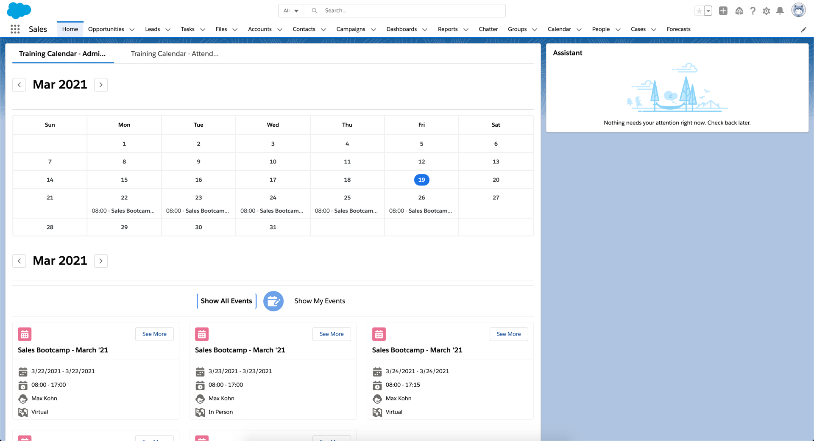

# [Instructor Led Training - Events Management](https://appexchange.salesforce.com/listingDetail?listingId=a0N3u00000MRkFXEA1&tab=e)

#### _Manage Instructor Led Training for your Employees, Customers, and Partners_

<h4 align="center">
	<a href="#getting-started">Getting Started</a> |
	<a href="#documentation">Documentation</a> |
	<a href="#license">License</a> |
</h4>

<p align="center">
	
</p>

---

## Getting Started

### Prerequisites

There are a few items you need to setup before installing:

1. You will need to [Enable Lightning Experience](https://trailhead.salesforce.com/en/content/learn/modules/lex_migration_introduction/lex_migration_introduction_administration).
2. You will need to [Enable My Domain](https://trailhead.salesforce.com/en/content/learn/modules/identity_login/identity_login_my_domain).

### Install

#### AppExchange

Please navigate to the AppExchange link below to install the component.

<p align="left">
	<a href="https://appexchange.salesforce.com/listingDetail?listingId=a0N3u00000MRkFXEA1&tab=e">
		
	</a>
</p>

#### SFDX

Deploy the source:

1. Clone this repository:

```
git clone https://github.com/SalesforceLabs/Instructor-Led-Training-Events-Management
cd Instructor-Led-Training-Events-Management
```

2. Authorize with your org and provide it with an alias (OrgAlias):

```
sfdx force:auth:web:login -a "OrgAlias"
```

3. Push the app to your org:

```
sfdx force:source:deploy --sourcepath force-app/main/default --json --loglevel fatal --targetusername "OrgAlias"
```

4. Open the default org:

```
sfdx force:org:open --targetusername "OrgAlias"
```


## Documentation

Read the [Documentation][docs-url] for external documentation on the package.


## License

[License][license-url]. Copyright © 2022 [Salesforce][author-url]

<!--- Images -->

[license-shield]: https://img.shields.io/badge/License-BSD%203--Clause-blue.svg

<!--- Urls -->

[repository-url]: https://github.com/SalesforceLabs/Instructor-Led-Training-Events-Management
[downloads-url]: https://github.com/SalesforceLabs/Instructor-Led-Training-Events-Management/releases
[issues-url]: https://github.com/SalesforceLabs/Instructor-Led-Training-Events-Management/issues
[license-url]: https://github.com/SalesforceLabs/Instructor-Led-Training-Events-Management/blob/Release/OpenSource/LICENSE
[author-url]: https://github.com/SalesforceLabs
[contributors-url]: https://github.com/SalesforceLabs/Instructor-Led-Training-Events-Management/contributors
[docs-url]: https://appexchange.salesforce.com/partners/servlet/servlet.FileDownload?file=00P4V00000rgsg5UAA